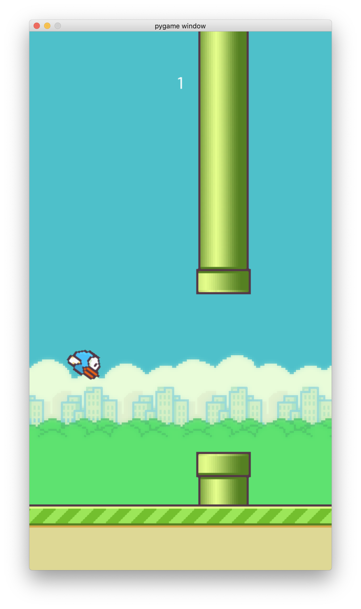

# Description
This game is off the classic flappy bird game. It's a replica and interacts similar to the mobile version of flappy bird. It keeps score and Generates random pipes to fly through.

# Development Environment
* Visual Studio Code
* Python 3.8.5

# Execution
To execute the program: `Python3 main.py`
 
or
 
click "run" button

# Useful Sites
* [flappy bird tutorial](https://youtu.be/UZg49z76cLw)
* [Stack Overflow](https://stackoverflow.com)
* [Automate the Boring Stuff with Python](https://automatetheboringstuff.com/2e/chapter9/)